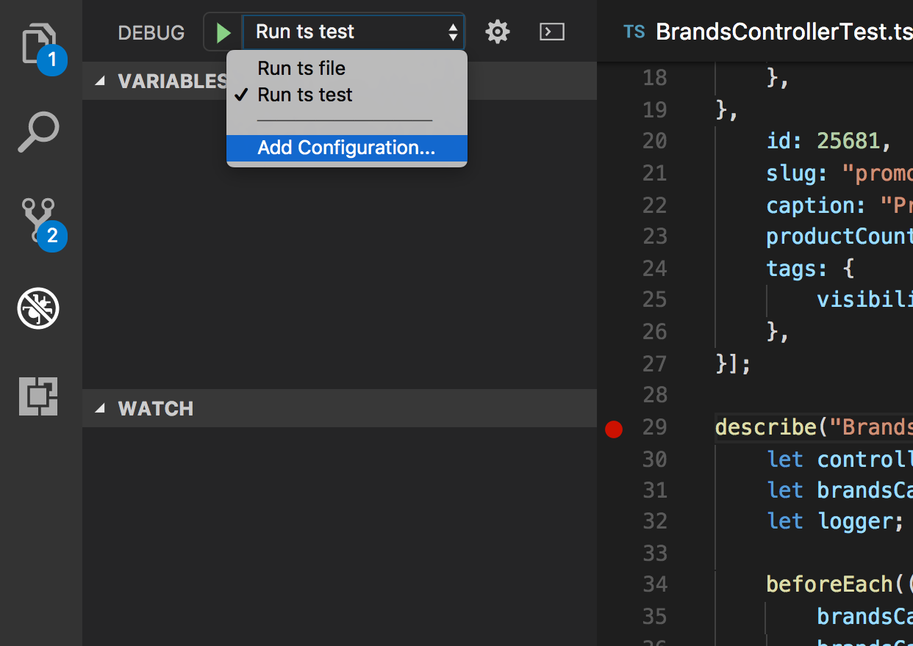

# style-helper

Develop with _style_

## Features
- Start/Stop Containers from wercker.yml
- Set environment variables for wercker container (RABBITMQ_PORT_32796_TCP_PORT, RABBITMQ_PORT_32796_TCP_ADDR)
- Add .vscode directory with debug settings
- Debug helper for vscode

## Installation
```
git clone https://github.com/freemountain/style-helper
cd style-helper
npm install
npm run build
npm link # Adds bin to Path
```

## Prerequisites
- style-helper should be in PATH
- all command should be run inside a style project
- env variable $DOCKER_HOST should be defined
- some projects (matching-worker) need additional env variables like:
    - REGISTRY_DOMAIN=gcr.io
    - REGISTRY_ORG=stylelounge-v1

## Commands

```
$ sth --help
Commands:
  debug          node debug wrapper for vscode
  env            generate shell script with env variables for tests
  vscode-add     add .vscode folder
  wercker-start  start containers from wercker.yml
  wercker-stop   stop containers from wercker.yml
  init           init project directory. Will run 'vscode-add', 'wercker-start', 'env'
```

## Usage
```
cd some-style-project
eval $(sth init)

# to stop the containers:
sth wercker-stop
```

## VS Code Debugger
After running `sth vscode-add` or `sth init` you should see the following run sections:

